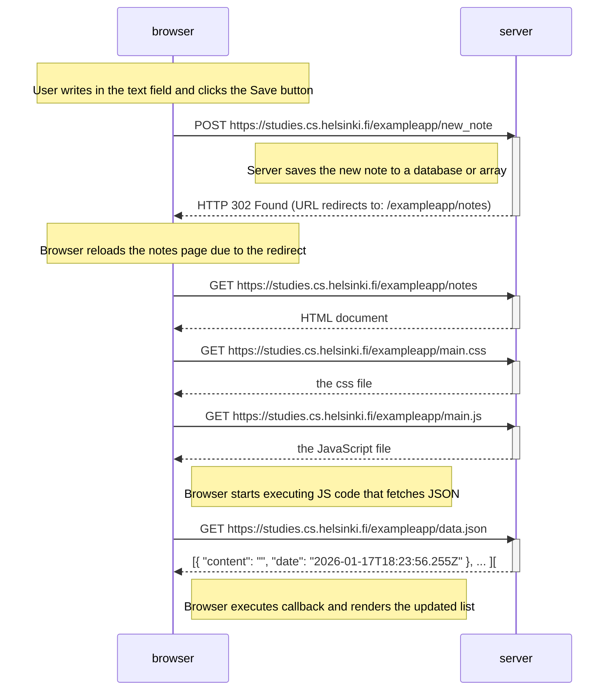

```mermaid
sequenceDiagram
    participant browser
    participant server

    Note over browser: <br/>User writes in the text field and clicks the Save button

    browser->>server: POST https://studies.cs.helsinki.fi/exampleapp/new_note
    activate server
    Note left of server:<br/>Server saves the new note to a database or array
    server-->>browser: HTTP 302 Found (URL redirects to: /exampleapp/notes)
    deactivate server

    Note over browser: <br/>Browser reloads the notes page due to the redirect

    browser->>server: GET https://studies.cs.helsinki.fi/exampleapp/notes
    activate server
    server-->>browser: HTML document
    deactivate server

    browser->>server: GET https://studies.cs.helsinki.fi/exampleapp/main.css
    activate server
    server-->>browser: the css file
    deactivate server

    browser->>server: GET https://studies.cs.helsinki.fi/exampleapp/main.js
    activate server
    server-->>browser: the JavaScript file
    deactivate server

    Note right of browser: <br/>Browser starts executing JS code that fetches JSON

    browser->>server: GET https://studies.cs.helsinki.fi/exampleapp/data.json
    activate server
    server-->>browser: [{ "content": "", "date": "2026-01-17T18:23:56.255Z" }, ... ][
    deactivate server

    Note right of browser: <br/>Browser executes callback and renders the updated list
```