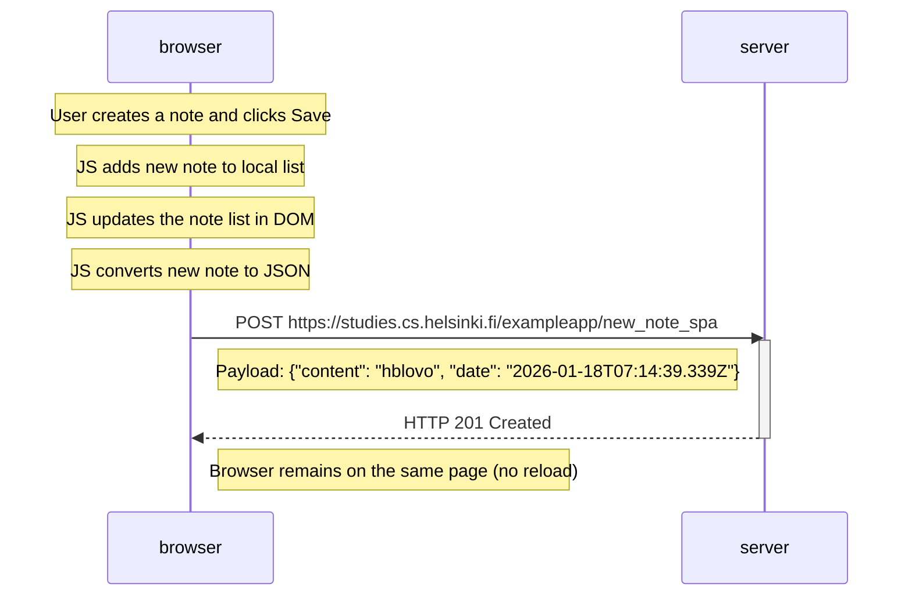

```mermaid
sequenceDiagram
    participant browser
    participant server

    Note over browser: User creates a note and clicks Save
    Note over browser: JS adds new note to local list
    Note over browser: JS updates the note list in DOM
    Note over browser: JS converts new note to JSON

    browser->>server: POST https://studies.cs.helsinki.fi/exampleapp/new_note_spa
    activate server
    Note right of browser: Payload: {"content": "hblovo", "date": "2026-01-18T07:14:39.339Z"}
    server-->>browser: HTTP 201 Created
    deactivate server

    Note right of browser: Browser remains on the same page (no reload)
```

